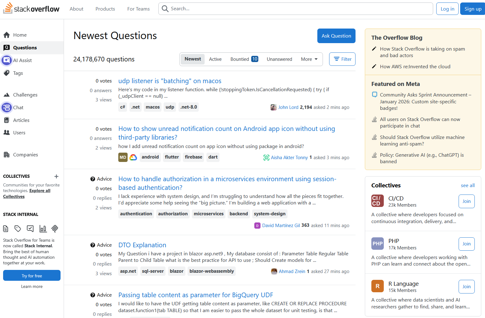
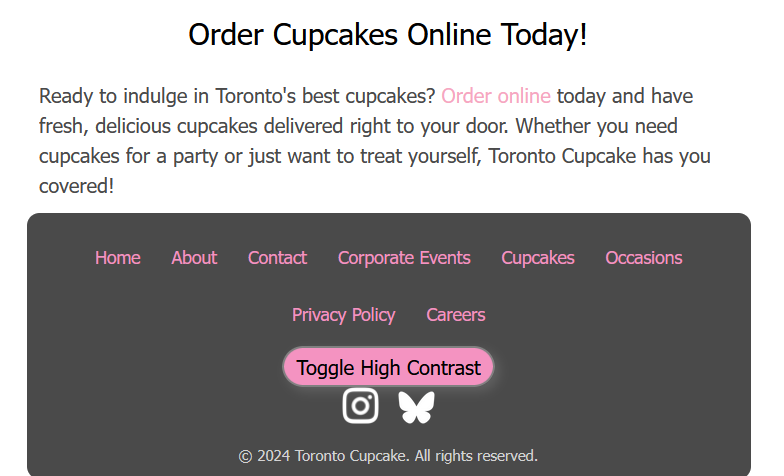

# Week 1 - Choosing a Website to Redesign

We began our term project in our UX/UI Design class, which is to learn UX/UI principles and processes by redesigning the UI of a poorly designed website

## How I Did it

My colleague and I looked through websites that we recently used and analyzed their user experience and the design of their user interfaces. I tried to find websites with established design themes and enough content to work with over a 13-week period. We chose 3 websites to potentially redesign to narrow it down to one choice.

## Choice 1 - The BCIT Program Application Page

We considered this site for its unorganized, difficult to read text, which make the website inconvenient to use.

## Choice 2 - Stack Overflow

We considered this site for the overwhelming amount of information displayed at once and the amount of small text, which make for an unpleasant and disorienting user experience.

## Choice 3 - Toronto Cupcake

The website that my partner and I decided on for the project is the [Toronto Cupcake Website](https://www.torontocupcake.com/index.html).

## Why We Chose Toronto Cupcake

We chose this website for 3 main reasons.

1. The business has 2 distinct audiences: corporations and people who enjoy cute desserts

   Toronto Cupcake provides custom branded cupcakes for corporate events. The business should have a design that appeals to this demographic as well as the general public. This intersection of demographics will make the design process more streamlined, as we will have a more specific goal in mind for a new design theme.

2. The website has enough content to redesign within 13 weeks.

   It contains 11 static pages with straightforward content such as text, images, or item listings.

3. The website has many aspects that need redesigning.

   The website has an inordinate amount of dead space, making the site appear unprofessional. It often contains large strings of small text, which can make the user feel frustrated or disinterested about what the text has to say. It implements hover state functionality when the user does not expect it, which can be jarring for users. The items in the sites footer are not properly spaced, which adds to the site's issue of appearing unprofessional.

These issues provides ample opportunities to analyze the site's UI as it relates to the principles of UX/UI design.
