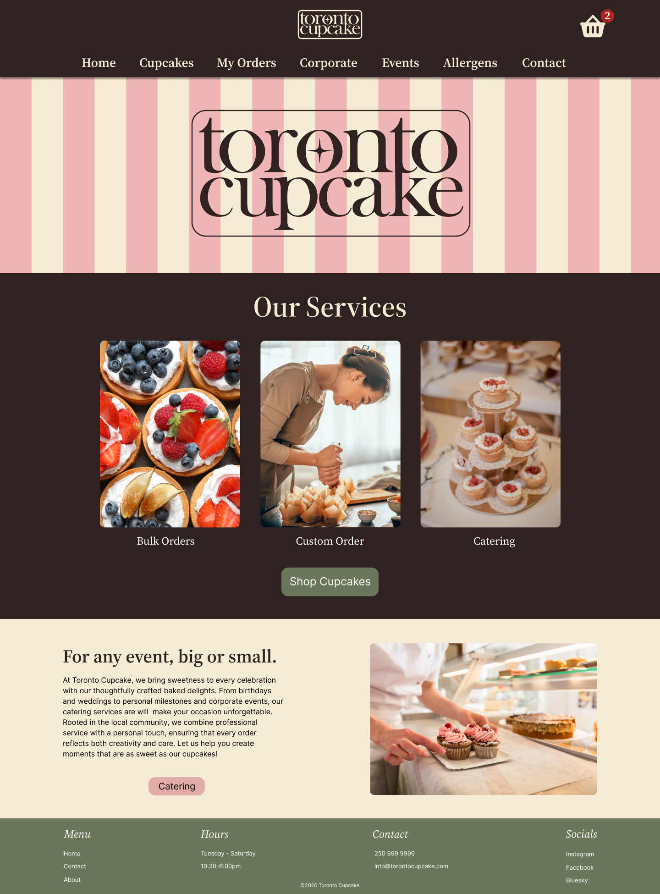
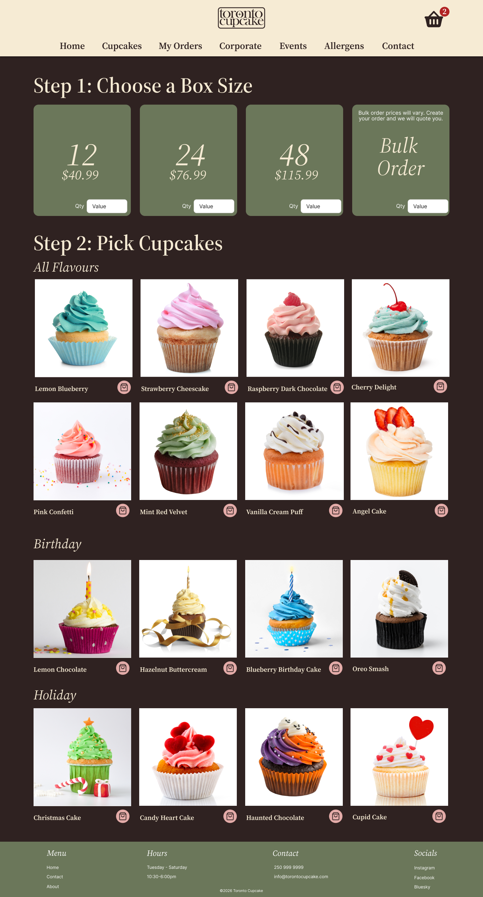
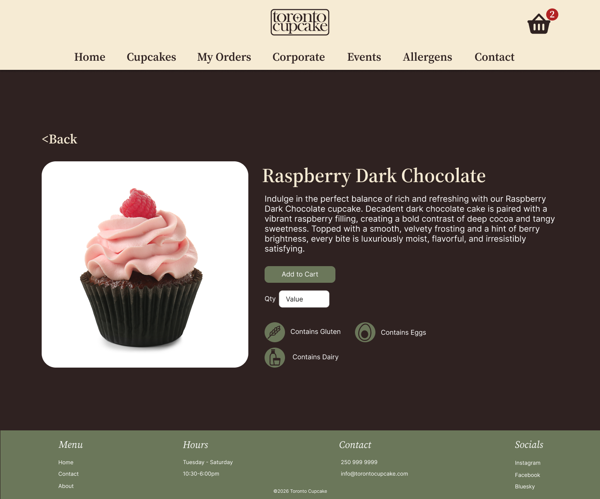
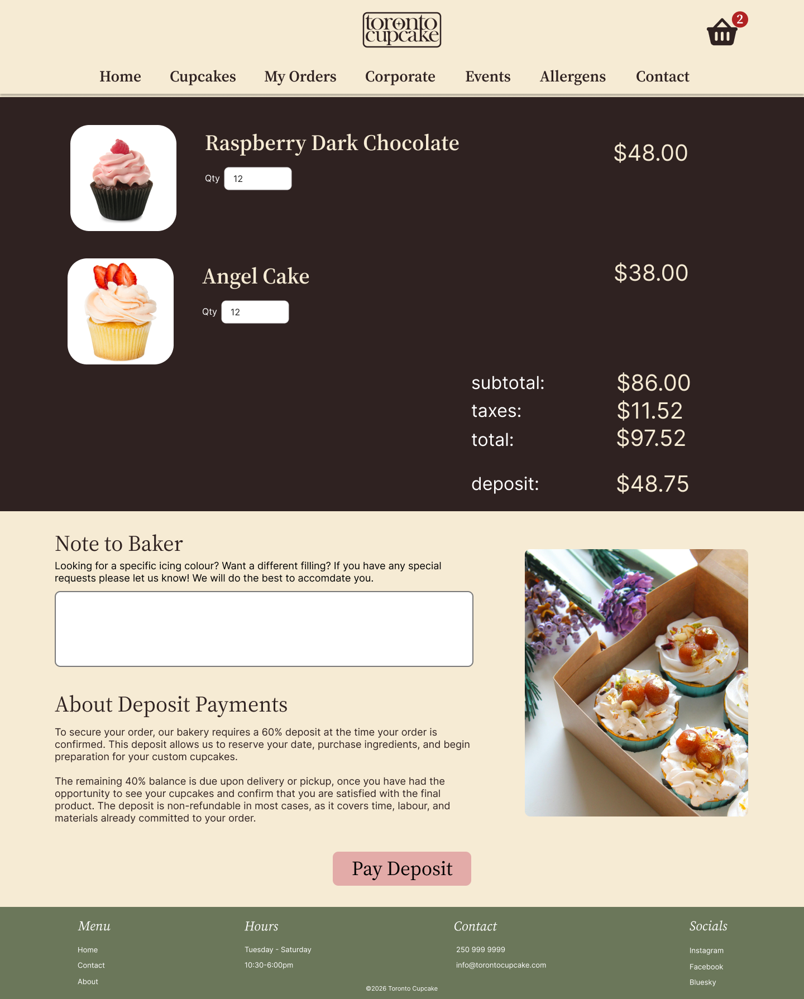

# Final Prototypes

This page details the process of applying given feedback to finish our redesign for the Toronto Cupcake website through Figma.

## Second Round of Testing

Having addressed the major issues from our [first round of testing](./9-user-testing.md), our feedback on our high-fidelity prototype was mainly regarding spacing and sizing of page elements. This meant that we were able to quickly apply necessary changes and deliver a final product.

## Highlighted Pages

As with the [paper-based prototypes](./7-low-fi-prototypes.md), only the most content-rich pages will be shown and discussed for the sake of conciseness.

### Homepage

[Paper-based prototype](./7-low-fi-prototypes.md#homepage)

Regarding the layout, the final prototype for this page is effectively the same as the sketched version. The most notable change is that the welcome message is replaced with "our services", which makes it clearer that the images below are clickable.

### Catalogue Page

[Paper-based prototype](./7-low-fi-prototypes.md#catalogue-page)

This section is laid out similarly to the paper-based wireframe, with changes made to the headers to address feedback from the [first round of testing](./9-user-testing.md#feedback) and ensure users don't skip the selection of box size.

### Single Cupcake Page

[Paper-based prototype](./7-low-fi-prototypes.md#single-cupcake-page)

This redesigned page addresses the original site's issue of lack of information on specific allergens.

### Cart Page

Our redesign of this page provides clearly given information on the payment process, which the original site did not make clear.

## Order Information Page

[Paper-based prototype](./7-low-fi-prototypes.md#order-information-page)

The original website did not feature a way for users to track the status of their order. This new page is easily accessible through the "my orders" link and clearly communicates all information the user might want to know.

## Conclusion

My partner and I are very happy with our final product. We managed to apply the concepts we learned in our UX/UI class and assess the needs of the business to form a design that addresses the issues of the original site. In addition to the design concepts we learned, my biggest takeaway from this project was how fun designing web projects can be. I look forward to working on similar projects in the future.
