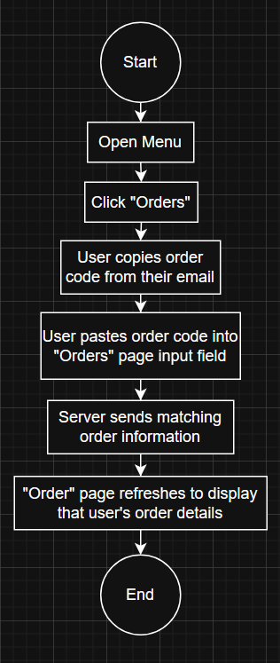

# User Flows

This section details how we built on [our user stories](./4-designing-for-users.md#user-stories) with user flows. These are flowcharts that outline the actions and decisions necessary for a user to complete specific tasks.

## User Flow 1

User Story:

> As an assistant ED, I want to know the specific time and place my cupcake order will be delivered so that I can plan accordingly.

These flows make immediately clear the necessary pages and features to complete this user story and the potential challenges in its implementation. Notably, it might not be immediately clear for the user that the order code is found in their email, which is something we will need to keep in mind in our redesign.

## User Flow 2

User Story:

> As a wedding planner, I want to easily learn about allergens of different cupcakes, so that I can order cupcakes suitable for all my guests.

From this flow, my partner and I concluded that allergen information needs to be shown both in the individual cupcake page for specific information per item, and an easily accessible allergen page for more details.

## User Flow 3

User Story:

> As a wedding planner, I want to easily order cupcakes in bulk, so that I can have an easier time organizing my wedding.

This final user flow is the longest, with steps that might not be intuitive. For example, users might not realize they need to select their order size before selecting their cupcakes, meaning we will need to take care in ensuring this process is clear for users.

## Conclusion

With these user flows laid out, our next step is to sketch the necessary screens for each story.
