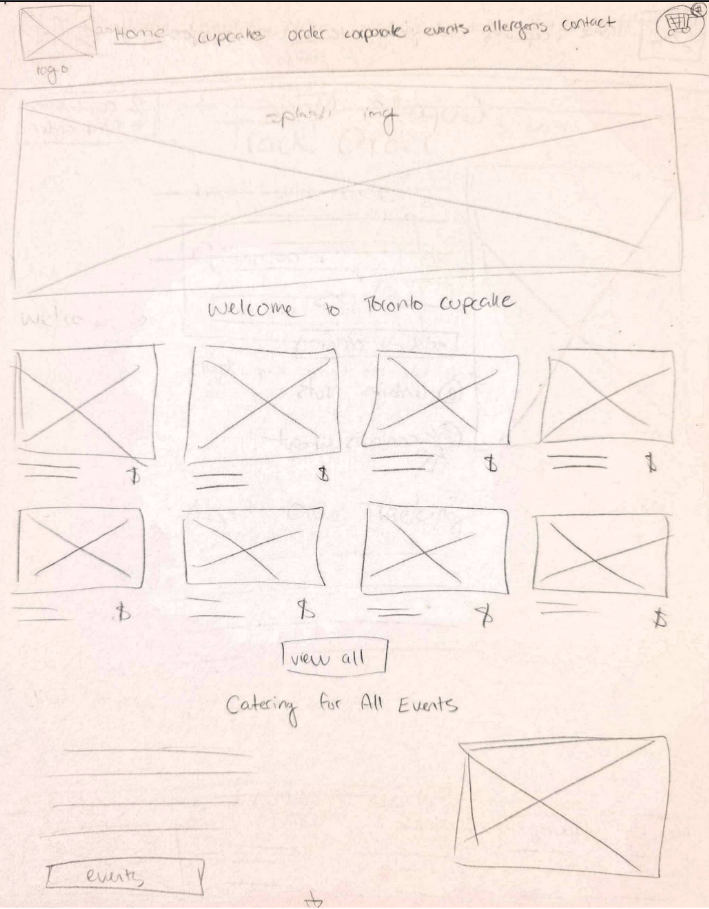
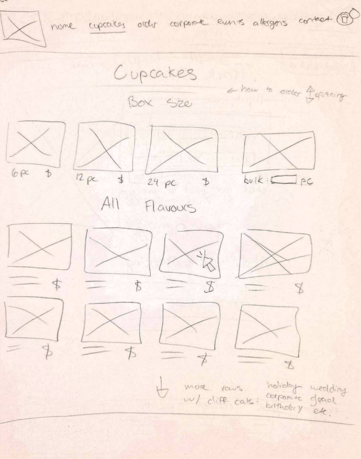

# Low-Fidelity Prototypes

This page covers our most detailed and relevant low-fidelity (low-fi) [wireframes](./glossary.md#wireframe) for each of [our user flows](./6-user-flows.md).

As we have over 10 pages of wireframes, most of which with self-explanatory layouts and functions, only the four most content-rich pages will be shown in this article.

## Homepage

This page features a [hero image](./glossary.md#hero-image) to create a strong impression on the user, followed by a section for featured cupcakes and an apparent call-to-action button. Information for events is given at the bottom with a button to a more detailed events page.

The boxes with X's inside represent images, and all irrelevant text is substituted for lines.

## Catalogue Page

This design demonstrates how we intend to manage bulk orders on our redesigned website. Users will first choose a box size or specify their desired amount of cupcakes, then choose from the cupcakes below.

## Single Cupcake Page

In the top right corner, there is a message displaying the amount of cupcakes left in the user's specified order size. The page also contains information of a specific cupcake's allergens.

## Order Information Page

This wireframe depicts the form where users can input their order codes to find information on their order. This wireframe also features a footer with general information that the user might find helpful.

## Conclusion

Our next steps are to [choose the fonts and colours](./8-colour-typography.md) for our redesign and [test these wireframes](./9-user-testing.md) to gain feedback and make revisions before building our high-fidelity (hi-fi) prototypes.
