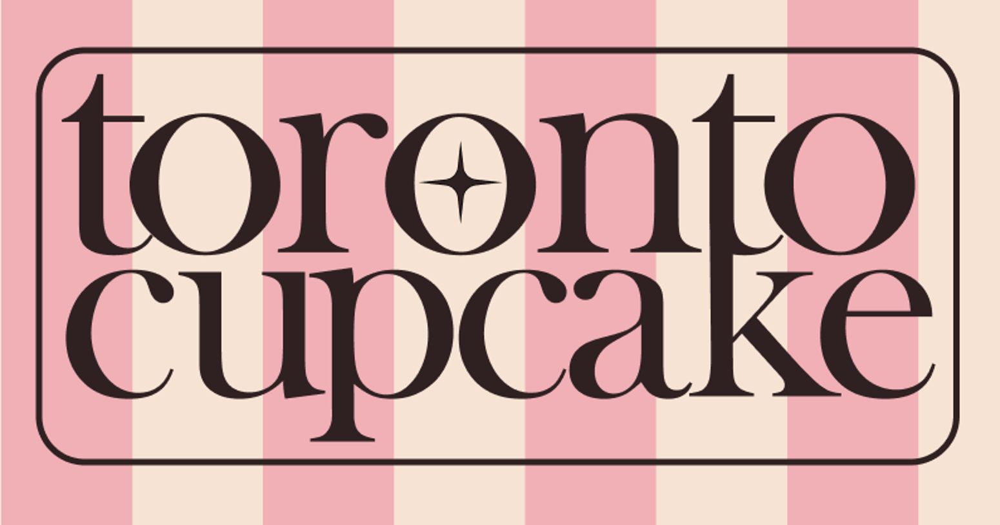

# Colour and Typography

This page details the process of selecting the colour palette and typography for our redesign.

## Considerations

To design a website that provides a satisfying user experience and appeals to most people, we needed to consider the following when choosing a colour scheme and fonts for the site:

- Accessibility: ensure sufficient _contrast_ in colour scheme and _readable_ fonts.
- Audience: design must appeal to both _corporate and casual_ customers.
- Credibility: typography and colours must give a _professional impression_.

## New Style Guide

This style guide features a new logo and word mark, readable and professional-looking fonts, and a distinct colour palette that caters to corporate and casual audiences.

## Logos

Featuring a bold serif font and homage to Toronto's CN tower through the connected T and K, this word mark promotes a sense of professionalism and connection to community, appealing to both casual and corporate residents of Toronto.

Conveying a sense of elegance through its minimalist design, the new letter mark for the business is both simple and unique, creating a recognizable brand for both of the business' demographics.

## Typography

## Palette
