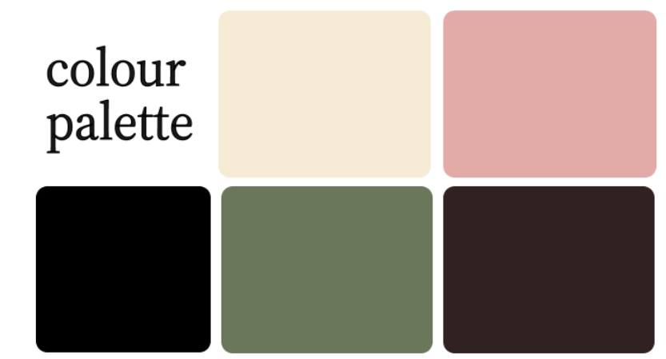

# Colour and Typography

This page details the process of selecting the colour palette and typography for our redesign.

## Considerations

To design a website that provides a satisfying user experience and appeals to most people, we needed to consider the following when choosing a colour scheme and fonts for the site:

- Accessibility: ensure sufficient _contrast_ in colour scheme and _readable_ fonts.
- Audience: design must appeal to both _corporate and casual_ customers.
- Credibility: typography and colours must give a _professional impression_.

## New Style Guide

This style guide features a new logo and word mark, readable and professional-looking fonts, and a distinct colour palette that caters to corporate and casual audiences.

## Logos

Featuring a bold serif font and an homage to Toronto's CN tower through the connected T and K, this word mark promotes a sense of professionalism and connection to community, appealing to both casual and corporate audiences in Toronto.

Conveying a sense of elegance through its minimalist design, the new letter mark for the business is both simple and unique, creating a recognizable brand for both of the business' demographics.

## Typography

Headers will use Source Serif 4 - Semi-Bold, a professional-looking font with a slight vintage flair. This font gives the site personality while maintaining an appeal to its corporate audience.

Subheaders will use Source Serif 4 - Italics, an elegant pair to the main headers.

The body text will use Inter, a font that prioritizes readability and makes the site accessible while complementing the other typefaces used.

## Palette

These colours were chosen for their unique and professional personality, having an appropriate amount of contrast, and evoking the sensations of desserts. The pink primary colour appeals to the business' general auidence, while not being overly-saturated, which might not appeal to the corporate demographic. The green secondary colour provides an appropriate level of contrast to the pink and reinforces the professional feel. The beige and brown offer more neutral tones that complement the other tones of the palette.

## Conclusion

With the design aspects given a clear direction with the style guide, the creation of the high-fidelity prototypes will become more streamlined and enjoyable.
