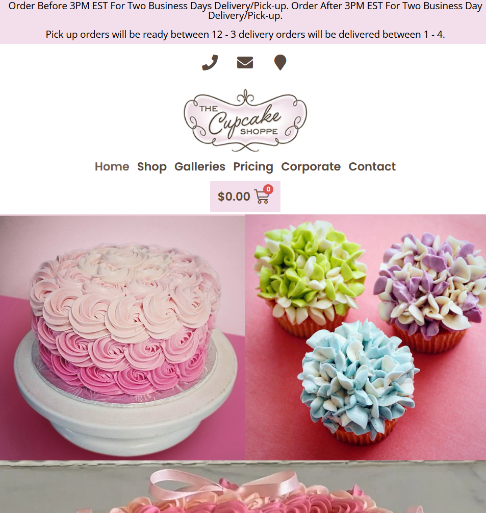

# Week 2 - Beginning the Design Process

The activities and assignments we were given this week involved us beginning to implement the [design processes and concepts](./week2-topics.md) we learned in class.

## Websites That Follow and Do Not Follow Usability Factors

To recognize the importance of each of the 7 usability factors, each group found one website that follows a specific usability factor and one that does not. My group was assigned to find a website that is **useable** and one that is **not valuable**.

Our choice for a website that is usable was [the BCIT website](https://www.bcit.ca/).

This website is useable as its information structure is very intuitive with very easy-to-read text. Users can navigate the website without many issues.

Our choice for a website that is not valuable is [MapQuest](https://www.mapquest.com/).

This website is no longer valuable as Google Maps fulfills its purpose while being ad-free and implementing more useful features.

## Redesign Proposal

This assignment involved us analyzing the [website for our term project](./week1.md) and the issues with the site to effectively brainstorm solutions that benefit the business.

After our analysis, we outlined **3 main issues** with the website.

- Poorly formatted navigation bar and information structure make the site difficult to navigate
- Unappealing formatting of the shop with a difficult to find cart page
- Inconsistent CSS styling with a theme that does not cater to the audience, giving the website a very unprofessional impression

We aim to resolve these issues by

- Polishing CSS styling
- Adding a tasteful amount of animations for a more professional look
- Adjusting the navigation bar to be easier to use
- Reordering information structure
- Adjusting branding colours to appeal to intended audiences

## Market Research

To better our understanding of what an effective website in this business would look like, we analyzed two other cupcake shop websites in the Toronto area.

### [Cupcake Paradise](https://www.cupcakeparadise.ca/)

This website succeeds at

- Making a professional impression with high-quality photos and well-structured interactive elements
- Utilizing a trendy design

This website could improve on

- Conveying a more apparent connection to community
- Branding that appeals to corporations (to compete with Toronto Cupcakes)

### [The Cupcake Shoppe](https://thecupcakeshoppe.ca/)

This website succeeds at

- Creating a sense of credibility through well-structured UI
- Implementing an intuitive and functional cart feature

This website could improve on

- Communicating information on the business itself and its place in the community
- Using higher-quality images

### Conclusion From Market Research

Our website redesign needs high-quality images, intuitive navigation bar structure, and an apparent connection to community.
